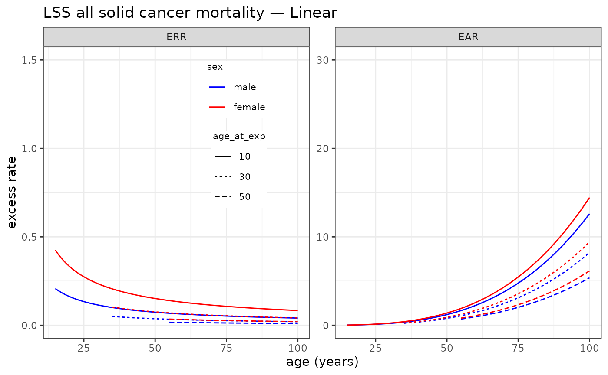
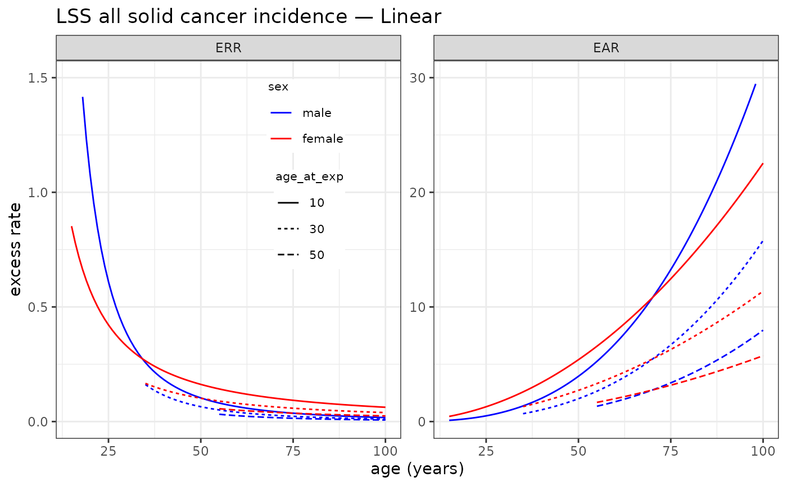
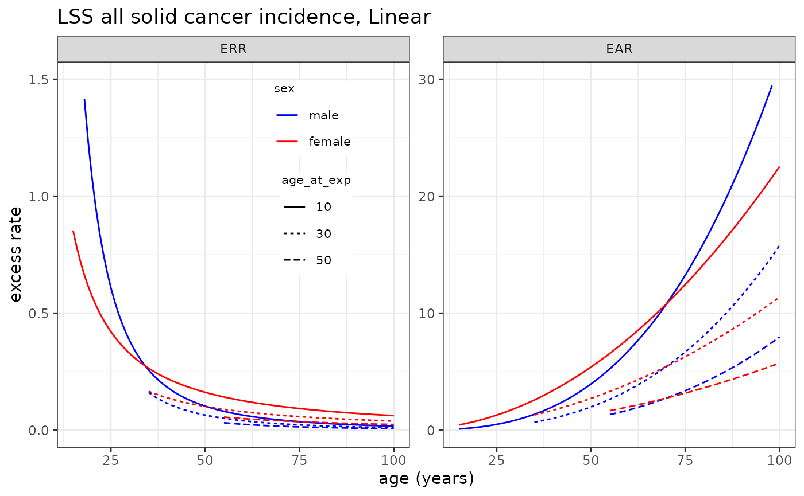

# Using/Specifying Risk Models

## Installation

``` r

library(CanEpiRisk)
```

## 1. Overview

`CanEpiRisk` supports two ways to supply risk models for lifetime risk
(CER, YLL) and related computations:

1.  **Predefined models** from the Life Span Study (LSS) of the Japanese
    atomic-bomb survivors for **mortality** and **incidence**:
    - `LSS_mortality` (mortality)
    - `LSS_incidence` (incidence)
2.  **User-specified models**, provided as a list with the components:
    - `para`: numeric vector of parameter estimates
    - `var`: variance–covariance matrix of `para`
    - `f(beta, data, lag)`: function returning the ERR/EAR given
      parameters `beta`, a `data` frame, and a minimum latency `lag`

The predefined models cover standard **ERR** (excess relative rate) and
**EAR** (excess absolute rate) formulations for multiple cancer sites.
The typical data fields expected by the model functions are:

- `dose` (e.g., Gy), `age` (attained age), `agex` (age at exposure), and
  `sex` (1 = male, 2 = female).

> **Notes** - Use `lag` to enforce a minimum latency between exposure
> and attained age (e.g., 5 y for solid cancers, 2 y for leukaemia). -
> Model objects are organized by **site** and **dose–response form**
> (e.g., `L` = linear, `LQ` = linear–quadratic), and each has `err`
> and/or `ear` entries.

## 2. Quick start

------------------------------------------------------------------------

## (1) Predefined risk models

### Mortality (LSS)

``` r

names(LSS_mortality)                 # sites with available mortality models
#> [1] "allsolid"  "esophagus" "stomach"   "colon"     "liver"     "lung"     
#> [7] "bladder"   "breast"    "leukaemia"
names(LSS_mortality$allsolid)        # available dose–response forms for all solid
#> [1] "L"  "LQ"
LSS_mortality$allsolid$L$err$para    # parameter vector (example)
#> [1] -0.861334 -0.346062 -0.857491  0.344098
LSS_mortality$allsolid$L$err$var     # variance–covariance matrix (example)
#>        colon10        ew30      lage70         msex
#> 1  0.014180600  0.00333207  0.01639360 -0.000677273
#> 2  0.003332070  0.00662021 -0.01588550 -0.001016880
#> 3  0.016393600 -0.01588550  0.17911000  0.003545970
#> 4 -0.000677273 -0.00101688  0.00354597  0.007714090
LSS_mortality$allsolid$L$err$f       # ERR function
#> function (beta, data, lag=5) {
#>               exp(beta[1])*data$dose * exp(beta[2] * (data$agex - 30)/10 + beta[3] * log(data$age/70)) *
#>            (1 + c(-1, 1)[data$sex] * beta[4]) * (data$age - data$agex >= lag )
#>        }
#> <bytecode: 0x562292d79bd8>
#> <environment: 0x562292d7aab8>
```

Plot an example (all solid, **linear ERR**):

``` r

plot_riskmodel(
  rm    = LSS_mortality$allsolid$L,
  title = "LSS all solid cancer mortality — Linear",
  leg_pos = c(0.4, 0.95)
)
```



### Incidence (LSS)

``` r

names(LSS_incidence)                 # sites with available incidence models
#>  [1] "allsolid"  "leukaemia" "esophagus" "stomach"   "colon"     "liver"    
#>  [7] "lung"      "prostate"  "pancreas"  "bladder"   "breast"    "thyroid"  
#> [13] "brainCNS"
names(LSS_incidence$allsolid)        # available dose–response forms for all solid
#> [1] "L"  "LQ"
LSS_incidence$allsolid$L$err$para    # parameter vector (example)
#>      sexMale:dgy    sexFemale:dgy   lage70:sexMale lage70:sexFemale 
#>        0.2731771        0.6398698       -2.5640146       -1.3783097 
#>              e30       hidoseTRUE 
#>       -0.2330051       -0.2761703
LSS_incidence$allsolid$L$err$var     # variance–covariance matrix (example)
#>                    sexMale:dgy sexFemale:dgy lage70:sexMale lage70:sexFemale
#> sexMale:dgy       0.0021308300   0.000526540   0.0119066187    -0.0015145731
#> sexFemale:dgy     0.0005265400   0.003944061  -0.0019637448     0.0057283111
#> lage70:sexMale    0.0119066187  -0.001963745   0.2072085784     0.0090031922
#> lage70:sexFemale -0.0015145731   0.005728311   0.0090031922     0.0708425868
#> e30               0.0008522796   0.001378741  -0.0046736366    -0.0053350872
#> hidoseTRUE       -0.0012531791  -0.002191058  -0.0002535854     0.0004417784
#>                            e30    hidoseTRUE
#> sexMale:dgy       0.0008522796 -0.0012531791
#> sexFemale:dgy     0.0013787414 -0.0021910581
#> lage70:sexMale   -0.0046736366 -0.0002535854
#> lage70:sexFemale -0.0053350872  0.0004417784
#> e30               0.0028724210 -0.0003010759
#> hidoseTRUE       -0.0003010759  0.0373994998
LSS_incidence$allsolid$L$err$f       # ERR function
#> function( beta, data, lag=5 ){  exp( beta[5]*(data$agex-30)/10 ) *
#>         (  (data$sex==1)*(beta[1]*data$dose) * exp(beta[3]*log(data$age/70)) 
#>          + (data$sex==2)*(beta[2]*data$dose) * exp(beta[4]*log(data$age/70)) )  * (data$age - data$agex >= lag )
#>            }
```

Plot an example (all solid, **linear ERR**):

``` r

plot_riskmodel(
  rm    = LSS_incidence$allsolid$L,
  title = "LSS all solid cancer incidence — Linear",
  leg_pos = c(0.4, 0.95)
)
#> Warning: Removed 5 rows containing missing values or values outside the scale range
#> (`geom_line()`).
```



## (2) User-specified risk models

You can define a model for any endpoint by supplying a list with the
required components. Below is a **template** for a linear ERR model
using the common covariates; adapt as needed.

``` r

my_err_fun <- function(beta, data, lag = 5) {
  # beta: parameter vector
  # data: data.frame with columns dose, age, agex, sex (1=male, 2=female)
  # lag : minimum latency (years)
  # Example linear in dose with modifiers:
  out <- exp(beta[1]) * data$dose *
         exp(beta[2] * (data$agex - 30) / 10 + beta[3] * log(data$age / 70)) *
         (1 + c(-1, 1)[data$sex] * beta[4]) *
         (data$age - data$agex >= lag)
  return(out)
}

my_model <- list(
  para = c(-0.86, -0.35, -0.86, 0.34),   # example values
  var  = diag(c(0.01, 0.01, 0.18, 0.008)),# example diagonal VCOV
  err  = list(para = c(-0.86, -0.35, -0.86, 0.34),
              var  = diag(c(0.01, 0.01, 0.18, 0.008)),
              f    = my_err_fun)
  # optionally: ear = list(para=..., var=..., f=...)
)
```

> **Tip**: Keep the parameter order in `para` consistent with how you
> index inside `f()`.

## 3. Example

As an example, the following shows how to specify the risk models on
derived from the INWORKS cohort for mortality from all solid cancer
(Richardson et al., 2015) and from leukaemia (Leuraud et al., 2015).
Note that the uncertainty in the only risk model parameter (ERR/Gy) is
specified by the 95% confidence interval, instead of the
variance-covariance matrix in the LSS risk models objects.

``` r

INWORKS_mortality <- NULL
INWORKS_mortality$allsolid <- NULL

INWORKS_mortality$allsolid$L <- list(
     err=list(
       para=c(0.47),                  # ERR/Gy=0.47 (90% CI: 0.18,0.79)  
       ci= c(0.1392403, 0.8521128),   #  95% CI coverted from 90%CI by Weibull approx.
       f=function (beta, data, lag=10) {
           beta[1] * data$dose  * (data$age - data$agex >= lag )
       }
       ),
      ear=list(    # dummry object
       para=c(4.8/10000),
       ci= c(0.1068428, 12.5703871)/10000,
       f=function (beta, data, lag=10) {
           beta[1] * data$dose  * (data$age - data$agex >= lag )
       } 
       )
 
  )

INWORKS_mortality$leukaemia$L <- list(
     err=list(
       para=c(2.96),                         # ERR/Gy=2.96 (90% CI: 1.17, 5.21) 
       ci= c(0.8664, 5.6940),
       f=function (beta, data, lag=2) {
           beta[1] * data$dose  * (data$age - data$agex >= lag )
       }
       ),
      ear=list(    # dummry object
       para=c(2.25/10000),
       ci=c(0.5064054, 4.4914628)/10000,
       f=function (beta, data, lag=2) {
           beta[1] * data$dose  * (data$age - data$agex >= lag )
       } 
       )
  )
INWORKS_mortality
#> $allsolid
#> $allsolid$L
#> $allsolid$L$err
#> $allsolid$L$err$para
#> [1] 0.47
#> 
#> $allsolid$L$err$ci
#> [1] 0.1392403 0.8521128
#> 
#> $allsolid$L$err$f
#> function (beta, data, lag = 10) 
#> {
#>     beta[1] * data$dose * (data$age - data$agex >= lag)
#> }
#> 
#> 
#> $allsolid$L$ear
#> $allsolid$L$ear$para
#> [1] 0.00048
#> 
#> $allsolid$L$ear$ci
#> [1] 1.068428e-05 1.257039e-03
#> 
#> $allsolid$L$ear$f
#> function (beta, data, lag = 10) 
#> {
#>     beta[1] * data$dose * (data$age - data$agex >= lag)
#> }
#> 
#> 
#> 
#> 
#> $leukaemia
#> $leukaemia$L
#> $leukaemia$L$err
#> $leukaemia$L$err$para
#> [1] 2.96
#> 
#> $leukaemia$L$err$ci
#> [1] 0.8664 5.6940
#> 
#> $leukaemia$L$err$f
#> function (beta, data, lag = 2) 
#> {
#>     beta[1] * data$dose * (data$age - data$agex >= lag)
#> }
#> 
#> 
#> $leukaemia$L$ear
#> $leukaemia$L$ear$para
#> [1] 0.000225
#> 
#> $leukaemia$L$ear$ci
#> [1] 5.064054e-05 4.491463e-04
#> 
#> $leukaemia$L$ear$f
#> function (beta, data, lag = 2) 
#> {
#>     beta[1] * data$dose * (data$age - data$agex >= lag)
#> }

# Plotting solid cancer mortality risk, male, 
#          6.7(100/15)mGy at ages 30-45, followed up to age 60, LSS-L, LSS-LQ and INWORKS models

exp4 <- list( agex=30:44+0.5, doseGy=rep(0.1/15,15), sex=1 )   # Exposure scenario
opt4_err <- list( maxage=90, err_wgt=1 )    # for ERR transfer
opt4_ear <- list( maxage=90, err_wgt=0 )    # for EAR transfer

lss_err_L  <- Comp_Exrisk( exposure=exp4, riskmodel=LSS_mortality$allsolid$L,     option=opt4_err )
lss_err_LQ <- Comp_Exrisk( exposure=exp4, riskmodel=LSS_mortality$allsolid$LQ,    option=opt4_err )
inw_err_L  <- Comp_Exrisk( exposure=exp4, riskmodel=INWORKS_mortality$allsolid$L, option=opt4_err )

lss_ear_L  <- Comp_Exrisk( exposure=exp4, riskmodel=LSS_mortality$allsolid$L,     option=opt4_ear, per=10^4 )
lss_ear_LQ <- Comp_Exrisk( exposure=exp4, riskmodel=LSS_mortality$allsolid$LQ,    option=opt4_ear, per=10^4 )
inw_ear_L  <- Comp_Exrisk( exposure=exp4, riskmodel=INWORKS_mortality$allsolid$L, option=opt4_ear, per=10^4 )

plot( c(30,90), c(0,0.1), type="n", ylab="Excess relative rate", xlab="age (years)" )
lines( lss_err_L, lty=2 )
lines( lss_err_LQ, lty=3 )
lines( inw_err_L )
```


``` r


plot( c(30,90), c(0,5), type="n", ylab="Excess absolute rate (cases per 10,000 person years)", xlab="age (years)" )
lines( lss_ear_L, lty=2 )
lines( lss_ear_LQ, lty=3 )
lines( inw_ear_L )
```



## References

Richardson, D.B., E. Cardis, R.D. Daniels et al. Risk of cancer from
occupational exposure to ionising radiation: retrospective cohort study
of workers in France, the United Kingdom, and the United States
(INWORKS). BMJ 351: h5359 (2015).

Richardson, D.B., K. Leuraud, D. Laurier et al. Cancer mortality after
low dose exposure to ionising radiation in workers in France, the United
Kingdom, and the United States (INWORKS): cohort study. BMJ 382: e074520
(2023).

Leuraud, K., D.B. Richardson, E. Cardis et al. Ionising radiation and
risk of death from leukaemia and lymphoma in radiation-monitored workers
(INWORKS): an international cohort study. Lancet Haematol 2(7): e276-281
(2015).
