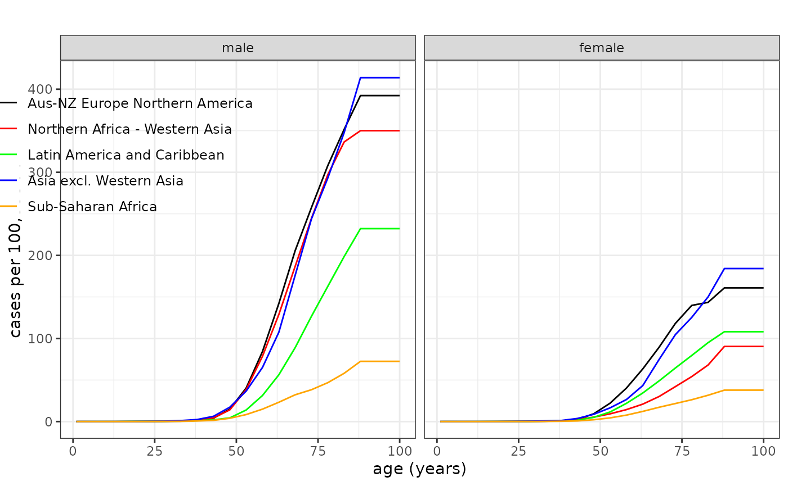
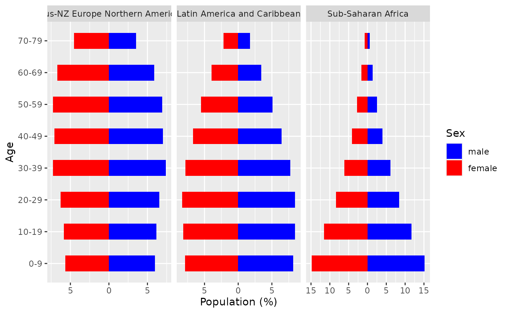

# Using/Specifying Reference Data

## Installation

``` r

library(CanEpiRisk)
```

## 1. Overview

This vignette explains how to **use the built‑in reference datasets**
(baseline cancer **mortality** and **incidence** rates) and how to
**provide your own** reference data in the format expected by
`CanEpiRisk`.

## 2. Quick start

------------------------------------------------------------------------

## (1) Predefined reference data

### Regions

Both `Mortality` and `Incidence` are **lists of length 5** corresponding
to WHO-like global regions:

1.  `"Aus-NZ Europe Northern America"`  
2.  `"Northern Africa - Western Asia"`  
3.  `"Latin America and Caribbean"`  
4.  `"Asia excl. Western Asia"`  
5.  `"Sub-Saharan Africa"`

Show region names:

``` r

names(Mortality)
#> [1] "Aus-NZ Europe Northern America" "Northern Africa - Western Asia"
#> [3] "Latin America and Caribbean"    "Asia excl. Western Asia"       
#> [5] "Sub-Saharan Africa"
names(Incidence)
#> [1] "Aus-NZ Europe Northern America" "Northern Africa - Western Asia"
#> [3] "Latin America and Caribbean"    "Asia excl. Western Asia"       
#> [5] "Sub-Saharan Africa"
```

### Sites and object structure

Each **regional element** is itself a list of **site-specific
data.frames**. The names of the sites available for `Mortality` data
are:

``` r

names(Mortality[[1]])
#>  [1] "esophagus"     "stomach"       "colon"         "liver"        
#>  [5] "pancreas"      "lung"          "breast"        "prostate"     
#>  [9] "bladder"       "brainCNS"      "thyroid"       "all_leukaemia"
#> [13] "all_cancer"    "allsolid-NMSC" "allsolid"      "leukaemia"    
#> [17] "allcause"      "survival"
```

The **canonical columns** of each site-specific data.frame are:

- `age` (integer, 1–100)  
- `male` (numeric)  
- `female` (numeric)

Rates are provided on a **one‑year age grid** (ages 1–100), which are
**linearly interpolated** from corresponding 5‑year rates in the
original source (for the highest age category (e.g., 85 or older), the
rates are fixed). Some tables (e.g., `allcause`) may also include
**person‑years** columns (`male_py` and `female_py`), which may be used
for population-based averaging of calculated risks.

Example (Region 1, all solid cancer mortality):

``` r

head(Mortality[[1]]$allsolid)
#>   age         male       female
#> 1   1 3.993729e-06 3.302123e-06
#> 2   2 1.198119e-05 9.906370e-06
#> 3   3 1.996865e-05 1.651062e-05
#> 4   4 1.946148e-05 1.625391e-05
#> 5   5 1.895432e-05 1.599719e-05
#> 6   6 1.844715e-05 1.574048e-05
tail(Mortality[[1]]$allsolid)
#>     age       male     female
#> 95   95 0.02189662 0.01180741
#> 96   96 0.02189662 0.01180741
#> 97   97 0.02189662 0.01180741
#> 98   98 0.02189662 0.01180741
#> 99   99 0.02189662 0.01180741
#> 100 100 0.02189662 0.01180741
```

Example (Region 3, leukaemia mortality):

``` r

head(Mortality[[3]]$leukaemia)
#>   age         male       female
#> 1   1 4.066002e-06 3.390723e-06
#> 2   2 1.219801e-05 1.017217e-05
#> 3   3 2.033001e-05 1.695362e-05
#> 4   4 2.103463e-05 1.704913e-05
#> 5   5 2.173925e-05 1.714464e-05
#> 6   6 2.244387e-05 1.724015e-05
tail(Mortality[[3]]$leukaemia)
#>     age         male       female
#> 95   95 0.0004455293 0.0002765286
#> 96   96 0.0004455293 0.0002765286
#> 97   97 0.0004455293 0.0002765286
#> 98   98 0.0004455293 0.0002765286
#> 99   99 0.0004455293 0.0002765286
#> 100 100 0.0004455293 0.0002765286
```

Example (Region 5, all-cause mortality with person-years):

``` r

head(Mortality[[5]]$allcause)
#>   age        male      female  male_py female_py
#> 1   1 0.056160846 0.048467260 18761.24  18253.13
#> 2   2 0.009220674 0.007515785 18127.85  17684.38
#> 3   3 0.007183781 0.006129537 17634.31  17232.95
#> 4   4 0.005848985 0.005303171 17194.27  16823.33
#> 5   5 0.004864717 0.004698722 16794.60  16448.30
#> 6   6 0.004105606 0.004193329 16422.67  16095.09
tail(Mortality[[5]]$allcause)
#>     age      male    female male_py female_py
#> 95   95 0.3576011 0.2754637  9.8210   23.4550
#> 96   96 0.3680964 0.2902003  6.9710   16.8780
#> 97   97 0.3780983 0.3040167  4.9220   11.9500
#> 98   98 0.3884477 0.3176900  3.4625    8.3635
#> 99   99 0.3989252 0.3305587  2.4190    5.8265
#> 100 100 0.4149599 0.3458980  1.6845    4.0590
```

### Visualizing baselines

Use
[`plot_refdata()`](https://kyojifurukawa.github.io/CanEpiRisk/reference/plot_refdata.md)
to compare site‑specific baselines across regions:

``` r

# Lung cancer mortality across regions (legend top-left-ish)
plot_refdata(dat = Mortality, outcome = "lung", leg_pos = c(0.27, 0.95))
```



## Using reference data in risk calculations

A typical calculation needs a **site-specific baseline** and **all‑cause
mortality** for the same region:

``` r

# Example: CER for all solid cancer mortality (Region 1), female,
# 0.1 Gy at age 15, follow to age 100, ERR model
exp  <- list(agex = 15, doseGy = 0.1, sex = 2)

ref  <- list(
  baseline  = Mortality[[1]]$allsolid,  # site baseline
  mortality = Mortality[[1]]$allcause   # all-cause mortality
)

mod  <- LSS_mortality$allsolid$L       # example risk model (linear ERR)
opt  <- list(maxage = 100, err_wgt = 1, n_mcsamp = 5000)

cer  <- CER(exposure = exp, reference = ref, riskmodel = mod, option = opt)
cer * 10000
#>         mle        mean      median  ci_lo.2.5% ci_up.97.5% 
#>    156.0667    157.7446    156.0157    115.7108    211.9025
```

Notes: - `sex` is typically coded `1 = male`, `2 = female`. -
`err_wgt = 1` yields pure **ERR**; `0` would be pure **EAR** (when
available).

------------------------------------------------------------------------

## (2) Providing your own reference data

You may replace the built‑in region lists with your own. CanEpiRisk
expects a **list-of-regions**, where each region is a **named list of
sites**, and each site is a **data.frame** with at least `age`, `male`,
`female` columns on ages `1:100`.

### Minimal template

``` r

# Build a custom region with two sites as an example
my_region <- list(
  allsolid = data.frame(
    age    = 1:100,
    male   = rep(0, 100),  # replace with your rates
    female = rep(0, 100)
  ),
  allcause = data.frame(
    age       = 1:100,
    male      = rep(0, 100),
    female    = rep(0, 100),
    male_py   = rep(NA_real_, 100),   # optional
    female_py = rep(NA_real_, 100)    # optional
  )
)
```

## Age distribution

`CanEpiRisk` has an list object `agedist_rgn` which contains information
about the age distribution for each of the WHO global regions.
`agedist_rgn` is used to compute the population-averaged risks using
functions `population_CER` and `population_YLL`. The age distribution
for a WHO global region can be plotted by using function
[`plot_agedist()`](https://kyojifurukawa.github.io/CanEpiRisk/reference/plot_agedist.md)
as below.

``` r

# Example: age distributions for Regions 1 and 5
 plot_agedist( regions=c(1,3,5) )
#> Scale for x is already present.
#> Adding another scale for x, which will replace the existing scale.
```



------------------------------------------------------------------------

## 3. Notes

- **Units:** Rates should be **per person-year** on the age grid. If
  your sources are in 5‑year groups, aggregate or **interpolate** to
  ages 1–100 to match the package convention.

------------------------------------------------------------------------

## 4. See also

- Package overview vignette and risk‑model vignette for how baselines
  are consumed in
  [`CER()`](https://kyojifurukawa.github.io/CanEpiRisk/reference/CER.md)
  and related functions.
